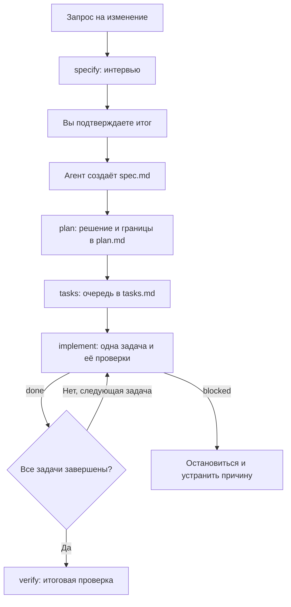

# Spec Kit

Spec Kit помогает агенту работать по спецификации. Агент записывает требования, план и задачи в Markdown, выполняет одну задачу за раз и сохраняет результаты проверок. Для этого достаточно установить skill. Отдельной программы, CLI или сборки нет.

## Установка

Нужен агент с поддержкой skills и доступом к файлам проекта. Для реализации и проверок понадобятся зависимости вашего проекта. Сам Spec Kit не требует Rust, Python или другой среды выполнения.

### Для человека

1. Откройте [репозиторий Spec Kit](https://github.com/Kat4X/spec-kit), выберите **Code → Download ZIP** и распакуйте архив. Можно также клонировать его через Git:

   ```bash
   git clone https://github.com/Kat4X/spec-kit.git
   ```

2. В скачанном репозитории найдите папку `.agents/skills/spec-kit/`. Каталог `.agents` скрытый, поэтому включите показ скрытых файлов в файловом менеджере.
3. В корне своего проекта создайте `.agents/skills/` и скопируйте туда папку `spec-kit` целиком. Если ваш агент использует другой каталог skills, поместите её туда. Не копируйте весь репозиторий и не ограничивайтесь одним `SKILL.md`.
4. Откройте новую сессию агента в своём проекте и попросите: "Покажи доступные действия Spec Kit". Если агент поддерживает slash-команды skills, можно написать `/spec-kit`.

После копирования проверьте структуру папки:

```text
.agents/skills/spec-kit/
├── SKILL.md
├── references/
└── assets/
```

Если папка `spec-kit` уже существует, перед заменой сохраните её копию вне каталога skills. Не смешивайте файлы разных версий. Остальные skills менять не нужно.

Если агент не видит Spec Kit, проверьте каталог установки по документации своего агента. Наличие файлов само по себе не означает, что агент загрузил skill.

### Для агента

Откройте чат агента в своём проекте и отправьте этот запрос:

```text
Установи Spec Kit из https://github.com/Kat4X/spec-kit в текущий проект.

Сначала выясни, какой каталог skills поддерживает этот агент.
Используй .agents/skills/, если он поддерживается; иначе используй
каталог из документации агента. Если определить его нельзя, спроси меня.

Получи репозиторий во временную папку. Скопируй из него только
.agents/skills/spec-kit/ целиком в каталог skills проекта под именем
spec-kit, сохранив SKILL.md, references/ и assets/.
Не устанавливай другие skills, CLI или зависимости из репозитория.

Если spec-kit уже установлен, не перезаписывай его без моего согласия.
Не меняй другие файлы проекта и не выполняй commit или push.

Проверь, что SKILL.md и все файлы из references/ и assets/
скопированы без изменений. Удали созданную тобой временную папку.
Сообщи путь установки и как вызвать skill. Если для обнаружения skill
нужна новая сессия, скажи об этом. Не создавай spec, plan или tasks
в рамках установки.
```

## Workflow

Запускайте этапы по очереди. Перед каждым агент проверяет результат предыдущего. Пустой шаблон не позволяет перейти дальше.



| Этап | Что происходит | Результат |
|---|---|---|
| `specify` | Вы описываете изменение. Агент изучает проект, задаёт вопросы по одному и ждёт вашего подтверждения. | После подтверждения агент создаёт `spec.md` с требованиями и критериями приёмки. |
| `plan` | Агент выбирает способ реализации. Вопросы о поведении продукта обсуждает с вами. | `plan.md` с решением, разрешёнными файлами, ограничениями и проверками. |
| `tasks` | Агент разбивает план на задачи, указывает зависимости и проверку для каждой. | `tasks.md` с очередью задач. |
| `implement` | Агент выполняет одну доступную задачу, запускает её обязательные проверки и записывает результат. | `done` после успешных проверок или `blocked` с причиной и следующим шагом. |
| `verify` | Агент сверяет весь результат с требованиями и границами плана, выполняет недостающие обязательные проверки. | Решение в разделе `Итоговая проверка` файла `tasks.md`: `готово`, `готово с замечаниями` или `заблокировано`. |

Повторяйте `implement`, пока задачи не завершены, затем запускайте `verify`. Даже после последнего `done` нужна итоговая проверка.

Вызовите `list`, чтобы узнать состояние работы и следующий шаг. Он ничего не меняет.

При статусе `blocked` сначала разберитесь с указанной причиной. Если `verify` обнаружил ошибку кода, попросите исправить её через `implement`, затем повторите `verify`.

Ошибку в требованиях исправляйте через `specify`, в способе реализации через `plan`. После изменения требований, плана или кода агент помечает затронутые результаты проверок как устаревшие.

## Использование в чате

Напишите `/spec-kit`, чтобы увидеть существующие папки изменений, их состояние и следующий доступный шаг. Такие папки называются workspace. Этот вызов ничего не создаёт и не меняет.

Остальные действия тоже вызываются в чате:

```text
/spec-kit specify Добавить экспорт задач в CSV
/spec-kit plan <workspace>
/spec-kit tasks <workspace>
/spec-kit implement <workspace>
/spec-kit verify <workspace>
/spec-kit list
```

Вместо `<workspace>` подставьте путь, который агент вернул после `specify`.

Можно писать обычными словами: "Создай spec для экспорта задач", "Составь план по этой spec", "Реализуй следующую задачу Spec Kit". Укажите точный путь к workspace или имя, которому соответствует только одна папка. Если подходят несколько папок, агент спросит, какую использовать.

Перед созданием spec агент проводит интервью по встроенным правилам grilling. Он задаёт по одному существенному вопросу, рекомендует ответ и объясняет почему. Факты из проекта выясняет сам.

После интервью агент показывает итог и ждёт вашего явного подтверждения. До этого он не создаёт папку изменения, spec или другие файлы. Подтверждение нужно даже тогда, когда исходный запрос содержит все ответы или вы попросили пройти весь цикл.

При уточнении существующей spec обязательного интервью нет. Отдельный skill grilling устанавливать не нужно. Ответы до создания spec остаются в разговоре, без отдельного файла интервью. Если контекст потерян, агент не может считать итог подтверждённым.

Обычный `implement` выполняет одну задачу. Чтобы выполнять задачи подряд до первого препятствия, попросите явно: "Выполни задачи export-tasks в batch". Для всего цикла: "Проведи экспорт задач через specify, plan, tasks, implement и verify".

В обоих режимах сохраняются требования к подтверждениям, границам изменений и обязательным проверкам. Одновременно писать в один workspace нельзя.

## Где хранится работа

```text
ai/specs/YYYY.MM.DD_HH-MM_change-name/
├── spec.md    # зачем и какой результат нужен
├── plan.md    # решение, файлы, границы и проверки
└── tasks.md   # задачи, результаты и итоговая проверка
```

Файлы появляются по мере прохождения `specify → plan → tasks → implement → verify`. Если имя новой папки занято, агент добавляет суффикс `-2`, затем `-3` и так далее. Исследования и модель данных остаются внутри `plan.md`, отдельные файлы для них не нужны.

Агент меняет только разрешённые в плане файлы. Для любого неуказанного пути нужно подтверждение. Задача получает `done` только после успешных обязательных проверок. Если проверка падает или её нельзя провести, задача остаётся `blocked`.

Файлы в `ai/specs/` остаются локальными. Агент не добавляет их в staging. Commit и push он выполняет только по явному запросу, а не автоматически после каждой задачи.

Подробности формата и переходов описаны в [контрактах артефактов](docs/artifact-contracts.md).

## Разработка skill

Инструкции находятся в `.agents/skills/spec-kit/SKILL.md` и `references/`, три шаблона в `assets/`. Для работы установленного skill файлы остального репозитория не нужны.

Для проверки изменений в этом репозитории нужен Python 3:

```bash
scripts/check
```

Команда проверяет наличие файлов, метаданные и ссылки skill, запускает модульные тесты Python и проверяет синтаксис JSON с примерами запросов для выбора действия. Она не оценивает ответы модели на эти примеры. Rust и сторонние Python-пакеты не нужны.
